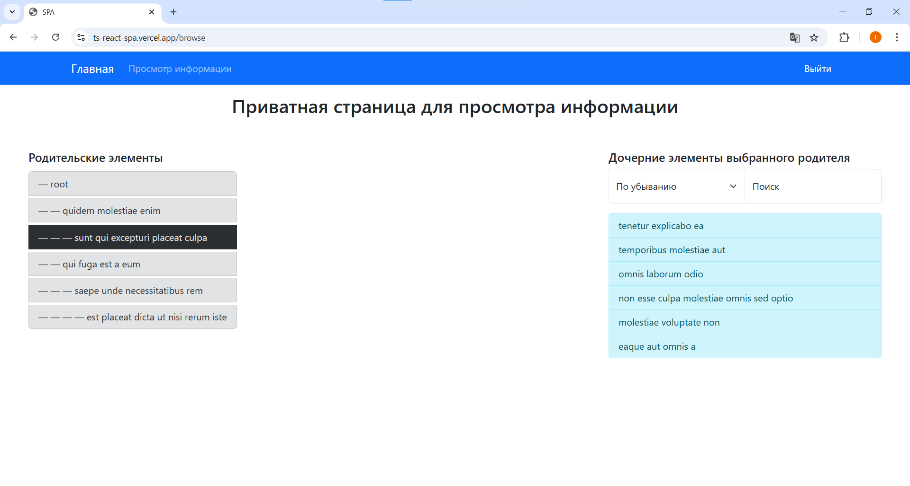

<h1>
    <div align="right">
        <a href="README.md"></a>
        <code><a href="#"></a></code>
    </div>
    ts-react-spa
</h1>

## Описание
Данное приложение представляет собой Single Page Application (SPA) для просмотра информации сервиса с возможностью
авторизации.  
Приложение состоит из трёх страниц:
- главная страница;
- приватная страница для просмотра информации сервиса;
- страница авторизации.

На **странице просмотра информации** реализовано отображение древовидной структуры данных, приходящей с сервера,
с возможностью просмотра дочерних элементов каждого родителя.

## Доступ
Приложение доступно по ссылке: https://ts-react-spa.vercel.app

***Примечание:** для входа нужно использовать один из следующих логинов и паролей:*
```js
const users = [
    { login: 'user1', password: 'password1' },
    { login: 'user2', password: 'password2' },
    { login: 'user3', password: 'password3' },
    { login: 'user4', password: 'password4' },
    { login: 'user5', password: 'password5' },
];
```

## Примеры работы веб-приложения
#### Страница входа
На скриншоте ниже показана страница входа на сайт. Просмотр информации на приватной странице доступен только
авторизованным пользователям.


#### Приватная страница с древовидной структурой данных
На приватной странице содержится дерево, которое присылает сервер. При клике на узел дерева справа будут показаны все
его дети. Детей можно соритровать по возрастанию или убыванию. Также есть поиск по тексту среди детей.



## Установка и использование
Клонируйте данный репозиторий.  
Перейти в директорию проекта (`cd .\ts-react-spa\`).  
В корне проекта выполните следующие команды:
```console
npm i
npm start
```
Откройте localhost.

## Зависимости
- **Node.js** v16.20.1 или более новая версия;
- **npm** v8.19.4 или более новая версия.

## Используемые технологии и инструменты
### Основные
- [ECMAScript 2021](https://www.w3schools.com/js/js_2021.asp)
- [TypeScript](https://www.typescriptlang.org/) `[5.2.2]`
### Интерфейс
- [React Bootstrap](https://react-bootstrap.netlify.app/) `[2.9.1]`
### Сборщик
- [webpack](https://webpack.js.org/) `[5.89.0]`
### Фейковый сервер
- [Mirage JS](https://miragejs.com/) `[0.1.48]`
