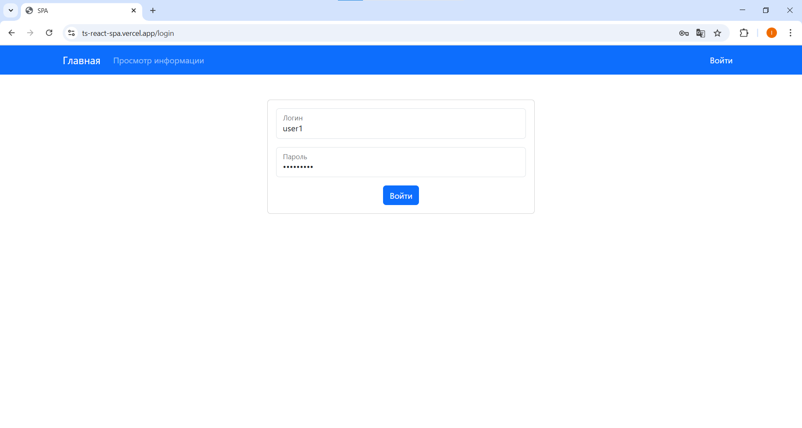
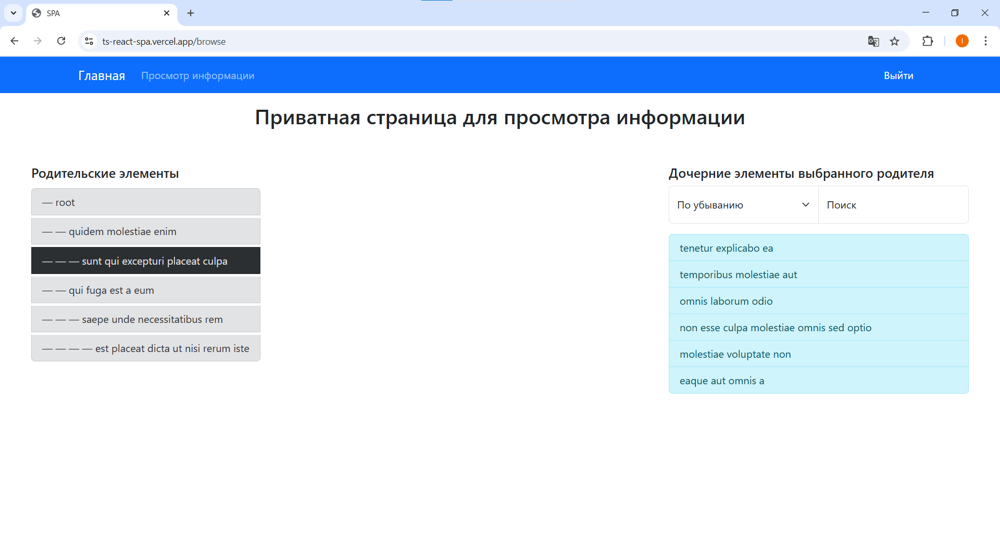

[](https://nodejs.org/en)
[](https://docs.npmjs.com/downloading-and-installing-node-js-and-npm)


<h1>
    <div align="right">
        <code><a href="#"></a></code>
        <a href="README-RU.md"></a>
    </div>
    ts-react-spa
</h1>

## About
This application is a Single Page Application (SPA) for viewing service information with the option of authorization.  
The application consists of three pages:
- main page;
- private page for viewing service information;
- authorization page.

The **information viewing page** displays a tree structure of data coming from the server, with the ability to view the
child elements of each parent.

## Try
The website is available at: https://ts-react-spa.vercel.app

***Note:** To log in, use one of the following usernames and passwords:*
```js
const users = [
    { login: 'user1', password: 'password1' },
    { login: 'user2', password: 'password2' },
    { login: 'user3', password: 'password3' },
    { login: 'user4', password: 'password4' },
    { login: 'user5', password: 'password5' },
];
```

## Demonstration
#### Login page
The screenshot below shows the website login page. Only authorised users can view information on the private page.



#### Private page with tree-structured data
The private page contains a tree sent by the server. When you click on a node in the tree, all its children will be
displayed on the right. Children can be sorted in ascending or descending order. There is also a text search function
among the children.



## Installation and Usage
Clone the repository.  
Go to the project directory (`cd .\ts-react-spa\`).  
In the project root run the commands:
```console
npm i
npm start
```
Open localhost.

## Dependencies
- **Node.js** v16.20.1 or later;
- **npm** v8.19.4 or later.

## Technologies and tools used
### Main
- [ECMAScript 2021](https://www.w3schools.com/js/js_2021.asp)
- [TypeScript](https://www.typescriptlang.org/) `[5.2.2]`
### UI
- [React Bootstrap](https://react-bootstrap.netlify.app/) `[2.9.1]`
### Module bundler
- [webpack](https://webpack.js.org/) `[5.89.0]`
### Fake server
- [Mirage JS](https://miragejs.com/) `[0.1.48]`
